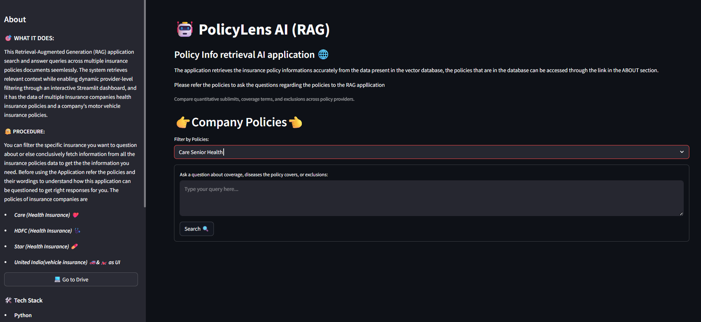

# 🤖  RAG_Multi_Insurer_Policy
An intelligent, aware Retrieval-Augmented Generation (RAG) system designed to search, compare, and answer queries across multiple insurance providers with source citations of multiple insurance policies.

## 🌟 Key Features
**🗂️ Structure-Aware Document Ingestion:** Uses pymupdf4llm to convert policy PDFs into structured Markdown, preserving critical tables, coverage sub-limits, and clause headers.

**🌐 Automated Metadata Tagging:** Automatically scans nested folder structures to tag chunks with provider names, document titles, and page numbers as metadata.

**🛢 Fast Vector Search (FAISS):** Embeds text chunks locally using Hugging face sentence-transformer and indexes them in a local FAISS vector database.

**🤝 Dynamic Provider Filtering:** Allows users to query all policies simultaneously or narrow searches down to specific insurance providers (e.g., Care, HDFC, Star, United India (Vehicle insurance)) directly in the Streamlit UI for bettersearch efficiency.

**🌎 Grounded LLM Responses:** Powered by Google Gemini via LangChain to produce precise, hallucination-free answers formatted in clean Markdown.

## 📱 Project Application Screenshots

### User Interface of the RAG application
*The web interface allows users to filter the policies specifically for more efficient search of the needed info from the DB*

### User Interface of the response

## 🛠️ Tech Stack & Tools

**Language:** Python

**Framework:** Langchain

**VectorDB:** FAISS (Facebook AI Similarity Search)

**Frontend:** Streamlit

**LLM:** Gemini (Google)

**Cloud Deployment:** HuggingFace Spaces

## 📐 Architecture & Pipeline Flow
       ┌─────────────────────────────────────────────────────────┐
       │            Offline Phase : preprocessing.ipynb          │
       │                                                         │
       │                                                         │
       │  PDF ──► Docling/pdfplumber ──► Chunks ──► Embeddings   │
       │                                                │        │
       └────────────────────────────────────────────────┼────────┘
                                                        ▼
                                             [ faiss_index/ Folder ]
                                             ├── index.faiss
                                             └── index.pkl
                                                        │
       ┌────────────────────────────────────────────────┼────────┐
       │             Online Phase : app.py                       │
       │                                                         │
       │                                                ▼        │
       │  User Question ──► Streamlit UI ──► FAISS.load_local()  │
       │                                               │         │
       │   LLM Response  ◄── Prompt + Context ◄────────┘         │
       └─────────────────────────────────────────────────────────┘
## Project Links & Author

**Repository:** [GitHub](https://github.com/cecsranjethaswinr23-collab/RAG_Multi_Insurer_Policy)

**Author:** Ranjeth Aswin Ravindran

**Connect with me:** 👋 [LinkedIn](www.linkedin.com/in/ranjeth-aswin-ravindran-018277253)
                         [GitHub](https://github.com/cecsranjethaswinr23-collab)

---